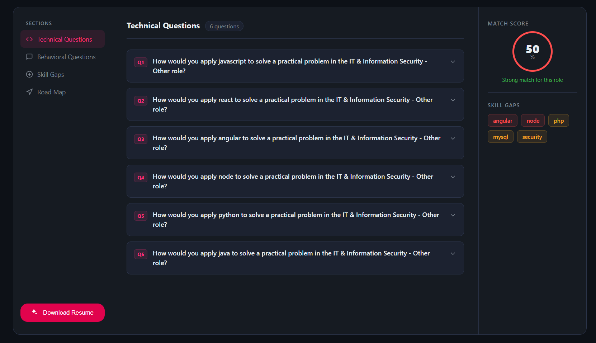

# CareerPilot AI 🚀

CareerPilot AI is a full-stack AI-powered career assistant platform that helps users analyze resumes, generate interview reports, detect skill gaps, and create ATS-friendly resume PDFs using Generative AI.

---

# 🌐 Live Demo

## Frontend

[https://career-pilot-ai-sigma.vercel.app](https://career-pilot-ai-sigma.vercel.app)

## Backend

[https://careerpilot-ai-zhgz.onrender.com](https://careerpilot-ai-zhgz.onrender.com)

---

# ✨ Features

* AI Resume Analysis
* ATS Match Score Generation
* AI Interview Report Generation
* AI Resume PDF Generation
* Skill Gap Detection
* Personalized Interview Preparation Plan
* JWT Authentication
* Resume Upload Support
* Cookie-based Authentication
* Protected Routes
* PDF Download Functionality
* Responsive UI

---

# 🖼️ Screenshots

## Home Page


## Interview Report




---

# 🛠️ Tech Stack

## Frontend

* React.js
* Vite
* SCSS
* Axios
* React Router DOM

## Backend

* Node.js
* Express.js
* MongoDB
* Mongoose
* JWT Authentication
* Multer
* Cookie Parser
* Puppeteer Core
* @sparticuz/chromium

## AI Integration

* Google Gemini API

---

# 📁 Project Structure

```bash
CareerPilot-Ai/
│
├── Frontend/
│   ├── src/
│   ├── public/
│   └── package.json
│
├── Backend/
│   ├── src/
│   ├── server.js
│   └── package.json
│
├── screenshots/
│
└── README.md
```

---

# ⚙️ Installation

## 1. Clone Repository

```bash
git clone <your-repository-url>
cd CareerPilot-Ai
```

---

# 💻 Frontend Setup

```bash
cd Frontend
npm install
npm run dev
```

Frontend runs on:

```bash
http://localhost:5173
```

---

# 🔧 Backend Setup

```bash
cd Backend
npm install
npm start
```

Backend runs on:

```bash
http://localhost:3000
```

---

# 🔑 Environment Variables

Create a `.env` file inside the Backend folder.

```env
PORT=3000
MONGODB_URI=your_mongodb_connection_string
JWT_SECRET=your_secret_key
GOOGLE_GENAI_API_KEY=your_gemini_api_key
FRONTEND_URL=http://localhost:5173
```

---

# 🤖 Gemini AI Model

Recommended model:

```txt
gemini-2.5-flash
```

---

# 📄 PDF Generation

This project uses:

```txt
puppeteer-core + @sparticuz/chromium
```

for serverless PDF generation on Render.

---

# 🔐 Authentication

* JWT Authentication
* HTTP-only Cookies
* Protected Routes
* Logout Token Blacklisting

---

# 📡 API Endpoints

## Authentication Routes

```http
POST /api/auth/register
POST /api/auth/login
POST /api/auth/logout
GET /api/auth/me
```

## Interview Routes

```http
POST /api/interview
GET /api/interview/:id
POST /api/interview/resume/pdf/:id
```

---

# 🚀 Deployment

## Frontend Deployment

Platform: Vercel

```bash
Root Directory: Frontend
Build Command: npm run build
```

## Backend Deployment

Platform: Render

```bash
Root Directory: Backend
Build Command: npm install
Start Command: npm start
```

---

# 📈 Future Improvements

* Multiple Resume Templates
* Multi-AI Provider Support
* Voice-based Mock Interviews
* AI Career Roadmaps
* Admin Dashboard
* User Analytics
* Resume History Tracking

---

# 👨‍💻 Author

Asmit Bhatt

---

# 📜 License

This project is licensed under the MIT License.
